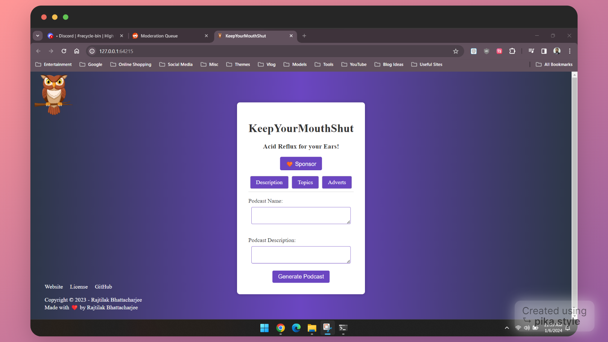

<!-- omit in toc -->
# KeepYourMouthShut - Acid Reflux for your Ears!

 &nbsp;  &nbsp;  &nbsp;  &nbsp; 

_[Please consider sponsoring this project to help keep it alive!]_

KeepYourMouthShut is an AI-assisted open-source app that provides a 360-degree podcast solution 🎙️ It has a developer-first approach for creating entire episodes of podcasts without requiring any expensive equpment or setup. The app takes a number of input from the end-user and based on that generates a script and an audio voice-over file based on that script.

<div align="center"></div>

<!-- omit in toc -->
## Table of Content

- [🚀 Installation](#-installation)
- [⚠️ Deployment](#️-deployment)
- [🛠️ Built With](#️-built-with)
- [🎸 Music](#-music)
- [🚸 Contributing](#-contributing)
- [🪫 Versioning](#-versioning)
- [🏅 Acknowledgement](#-acknowledgement)
- [🕹️ License](#️-license)
- [📟 Citation](#-citation)

## 🚀 Installation

For local installation, clone the repository and run the following commands:

1. `pip install -r requirements.txt`
2. `python app/keepyourmouthshut.py`

This will start the Flask app on port 64215 within a development environment. To run the app in production, delete `debug="TRUE"` in the `app/keepyourmouthshut.py` file. You can view the app in your browser at `http://localhost:64215/`.

## ⚠️ Deployment

This app can be deployed on AWS. The following official tutorial from AWS will show you how to serve a Flask app on AWS:

https://aws.amazon.com/tutorials/serve-a-flask-app/

If you want to deploy this app on AWS Lambda as a Serverless function, you can use <a href="https://github.com/zappa/Zappa" target="_blank">Zappa</a>.

## 🛠️ Built With

- [Python](https://www.python.org/)
- [llmOS](https://www.llmos.dev/)
- [edge-tts](https://github.com/rany2/edge-tts)
- [ElevenLabs text2speech](https://elevenlabs.io/text-to-speech)
-[OpenAI API](https://openai.com/)
- [Pixabay](https://pixabay.com/music/)

## 🎸 Music

- Whistle Vibes - Music by <a href="https://pixabay.com/users/top-flow-production-28521292/?utm_source=link-attribution&utm_medium=referral&utm_campaign=music&utm_content=172471">Sergio Prosvirini</a> from <a href="https://pixabay.com/music//?utm_source=link-attribution&utm_medium=referral&utm_campaign=music&utm_content=172471">Pixabay</a>
- Scandinavianz Thessaloniki - Music by <a href="https://pixabay.com/users/musicbyscandinavianz-35973063/?utm_source=link-attribution&utm_medium=referral&utm_campaign=music&utm_content=173689">Oliver Moilanen</a> from <a href="https://pixabay.com/music//?utm_source=link-attribution&utm_medium=referral&utm_campaign=music&utm_content=173689">Pixabay</a>
- Lofi Chill (medium version) - Music by <a href="https://pixabay.com/users/bodleasons-28047609/?utm_source=link-attribution&utm_medium=referral&utm_campaign=music&utm_content=159456">Bohdan Kuzmin</a> from <a href="https://pixabay.com/music//?utm_source=link-attribution&utm_medium=referral&utm_campaign=music&utm_content=159456">Pixabay</a>
- Bolero - Music by <a href="https://pixabay.com/users/lesfm-22579021/?utm_source=link-attribution&utm_medium=referral&utm_campaign=music&utm_content=161191">Oleksii Kaplunskyi</a> from <a href="https://pixabay.com//?utm_source=link-attribution&utm_medium=referral&utm_campaign=music&utm_content=161191">Pixabay</a>

## 🚸 Contributing

Please read [CONTRIBUTING.md](CONTRIBUTING.md) for details on our code of conduct, and the process for submitting pull requests to us.

## 🪫 Versioning

We use [SemVer](http://semver.org/) for versioning. For the versions available, see the [tags on this repository](https://github.com/rajtilakjee/keepyourmouthshut/tags).

## 🏅 Acknowledgement

1. Adam Tal - https://github.com/AdmTal
2. rany2 - https://github.com/rany2

## 🕹️ License

This project is licensed under the GPL-3.0 license, see the [LICENSE.md](LICENSE.md) file for details

## 📟 Citation

```
cff-version: 1.2.0
message: "If you use this software, please cite it as below."
authors:
- family-names: "Bhattacharjee"
  given-names: "Rajtilak"
  orcid: "https://orcid.org/0009-0008-2465-0266"
title: "keepyourmouthshut"
version: 0.0.1
doi: 10.5281/zenodo.10199470
date-released: 2023-11-23
url: "https://github.com/rajtilakjee/keepyourmouthshut"
```
